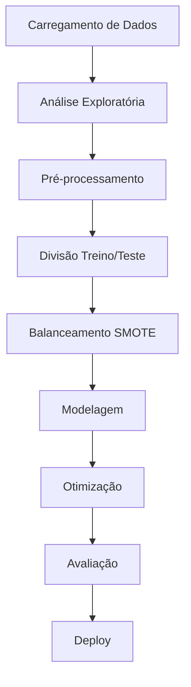

# 📊 Análise Preditiva de Rotatividade de Clientes

## 🚀 Visão Geral
Este projeto implementa uma solução completa de machine learning para previsão de rotatividade de clientes (churn) utilizando dados históricos. O sistema identifica clientes com risco de abandono e fornece insights acionáveis para estratégias de retenção.


## 🔧 Tecnologias Utilizadas
**Linguagens e Frameworks:**
- 
- 
- 
- 

**Ferramentas:**
- 
- 
- 

**Técnicas Avançadas:**
- SMOTE para balanceamento de classes
- Otimização de hiperparâmetros com GridSearchCV
- Validação cruzada (5 folds)
- Métricas de avaliação multicritério

## 📂 Estrutura do Projeto
```bash
├── dados/                   # Pasta com conjuntos de dados
│   └── dados_df.csv         # Dataset principal
├── notebooks/               # Jupyter notebooks
│   └── Challenge_TeleconX_Parte2.ipynb  # Notebook principal
├── relatorios/              # Relatórios e visualizações
│   ├── metricas_modelos.png # Comparativo de métricas
│   └── curva_roc.png        # Curva ROC comparativa
├── README.md                # Documentação do projeto
└── requirements.txt         # Dependências do projeto
```

## ⚙️ Implementação

### 🔄 Fluxo de Processamento


### 🔑 Componentes Chave
1. **Pré-processamento Inteligente**
   - Codificação de variáveis categóricas (One-Hot Encoding)
   - Normalização de features numéricas
   - Tratamento de dados ausentes

2. **Balanceamento Estratégico**
   ```python
   smote = SMOTE(random_state=42)
   X_train_res, y_train_res = smote.fit_resample(X_train, y_train)
   ```

3. **Otimização Rigorosa**
   ```python
   grid_search = GridSearchCV(
       pipeline,
       param_grid=params,
       cv=5,
       scoring='roc_auc',
       n_jobs=-1,
       verbose=1
   )
   ```

4. **Avaliação Abrangente**
   ```python
   print(classification_report(y_test, y_pred))
   plot_confusion_matrix(model, X_test, y_test)
   ```

## 📈 Resultados e Conclusões

### Comparação de Modelos
| Modelo           | AUC Score | Precisão (Churn) | Recall (Churn) | F1-Score (Churn) |
|------------------|-----------|------------------|----------------|------------------|
| Random Forest    | 0.8387    | 0.55             | 0.69           | 0.61             |
| Gradient Boosting| 0.8438    | 0.60             | 0.72           | 0.65             |

### Insights Principais
1. 🎯 **Gradient Boosting** apresentou melhor desempenho geral (AUC = 0.8438)
2. ⚖️ Estratégia de SMOTE eficaz para lidar com desbalanceamento
3. 📉 Modelos apresentam melhor performance na classe majoritária
4. ⏱️ Features como `Charges.Total` e `Estágio` são altamente preditivas

## 🚀 Recomendações para Produção

### Implementação
```python
# Exemplo de API Flask para deploy
from flask import Flask, request, jsonify
import joblib

app = Flask(__name__)
model = joblib.load('melhor_modelo.pkl')

@app.route('/predict', methods=['POST'])
def predict():
    data = request.json
    prediction = model.predict_proba([data['features']])
    return jsonify({'churn_probability': prediction[0][1]})

if __name__ == '__main__':
    app.run(host='0.0.0.0', port=5000)
```

### Estratégias de Ação
1. **Segmentação de Clientes**
   - Priorizar clientes com probabilidade >70% de churn
   - Oferecer planos personalizados

2. **Monitoramento Contínuo**
   - Recalibrar modelos trimestralmente
   - Acompanhar mudanças no perfil dos clientes

3. **Integração com CRM**
   ```mermaid
   sequenceDiagram
       Sistema ML->>CRM: Alertas de risco de churn
       CRM->>Agentes: Notificações prioritárias
       Agentes->>Cliente: Ofertas personalizadas
   ```

4. **KPI de Sucesso**
   - Redução de 15% na taxa de churn em 6 meses
   - Aumento de 10% na receita por cliente

## 👨‍💻 Autor
**Jefferson Ferreira**  
[](https://www.linkedin.com/in/jefferson-ferreira-ds/)
[](https://github.com/francaferreira/)

**Principais Contribuições:**
- 🔍 Análise exploratória de dados
- 🤖 Desenvolvimento da pipeline de ML
- 📊 Visualização de resultados
- 🚀 Implementação da solução

**Próximos Passos:**
1. Desenvolver dashboard de monitoramento
2. Implementar sistema de alertas em tempo real
3. Testar técnicas de deep learning
4. Expandir para previsão de lifetime value

---
